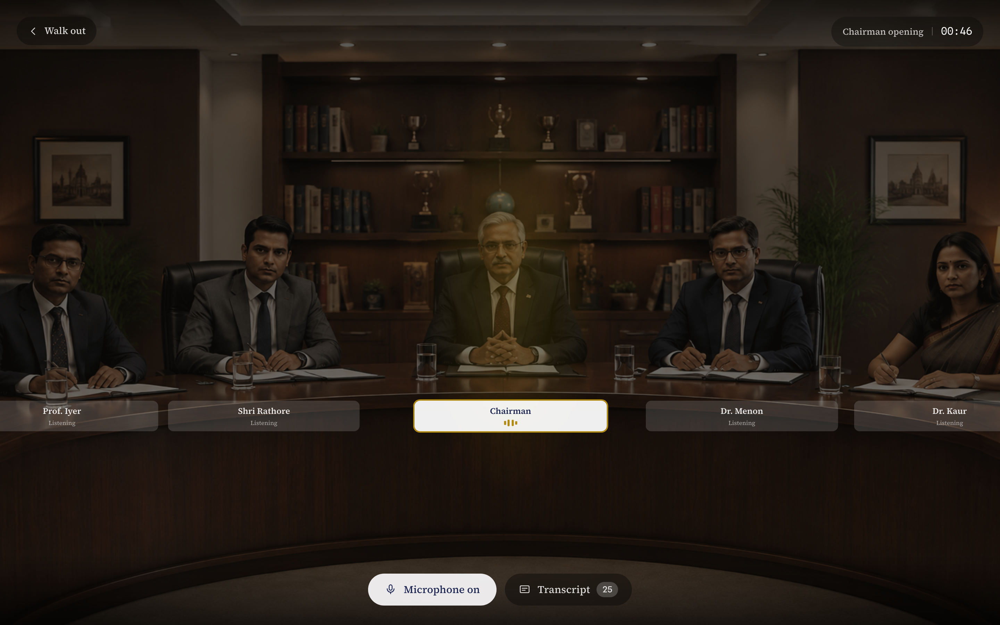
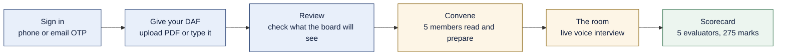
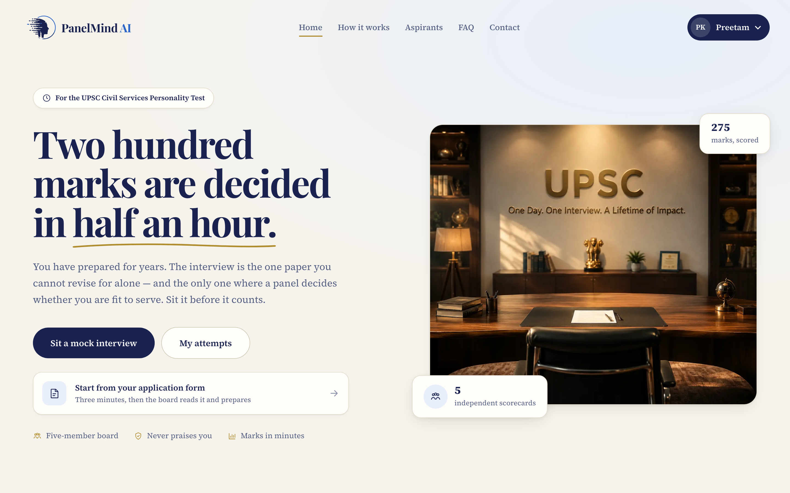
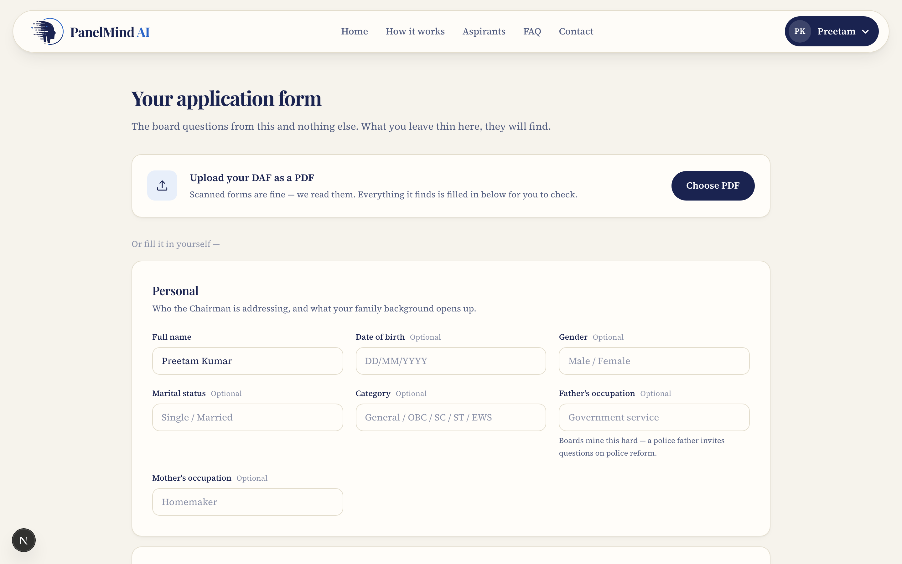
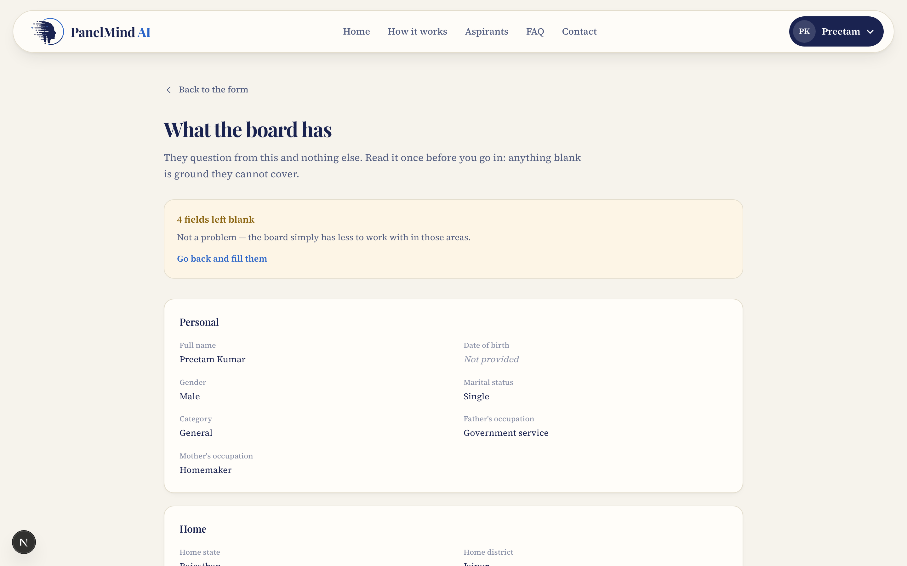
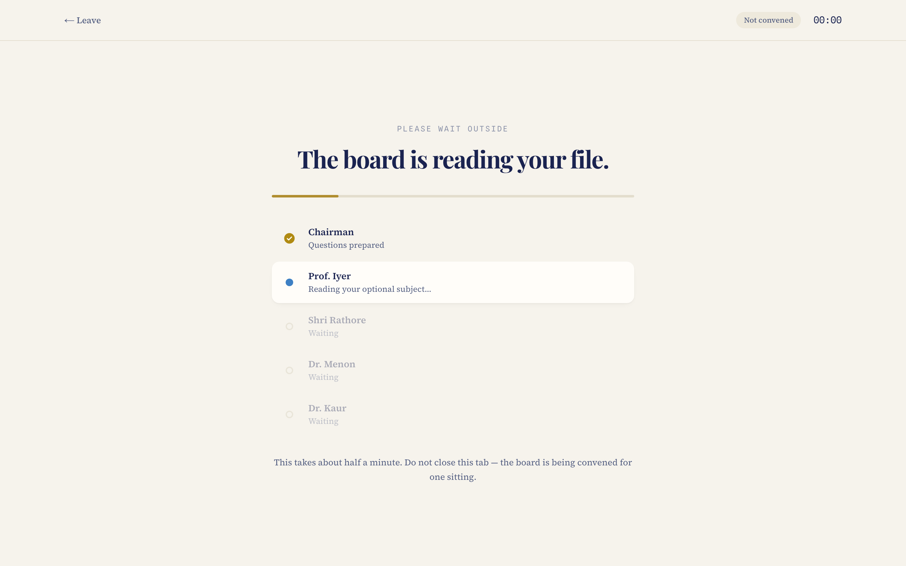
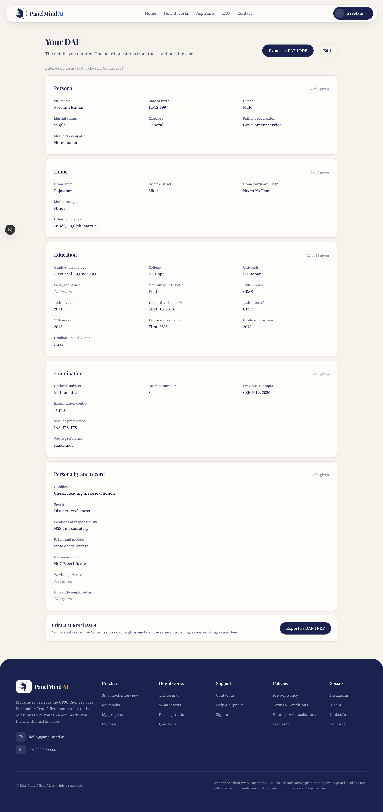
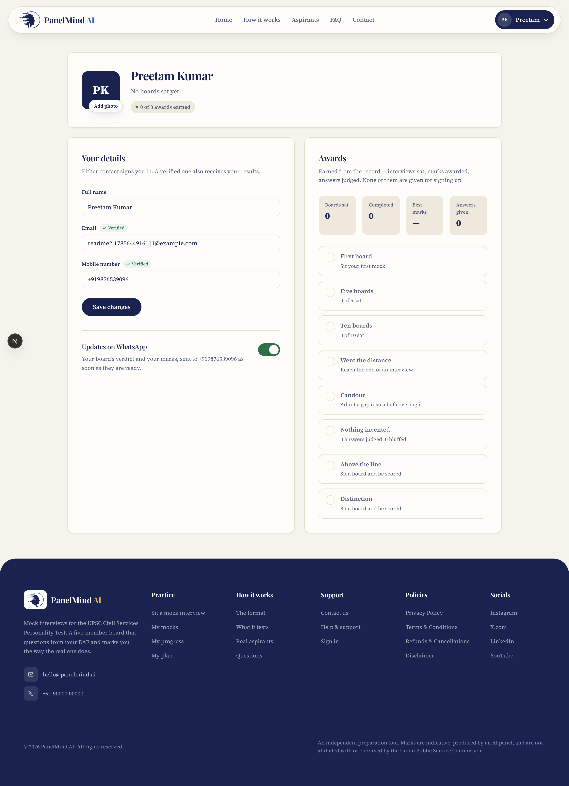
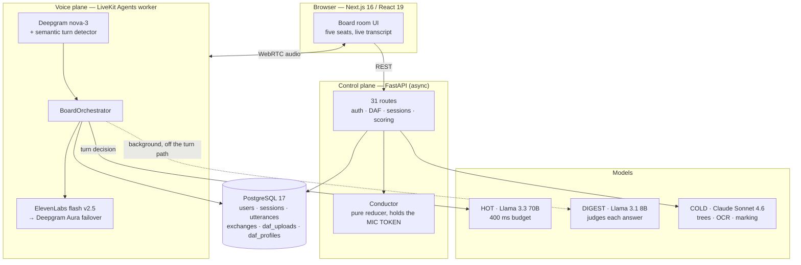
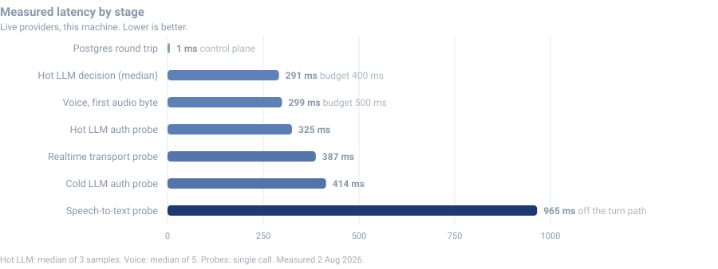

<div align="center">


# PanelMind AI

**Five AI board members interview one aspirant, aloud, and mark them the way the real board does.**

A production-grade mock interview simulator for the **UPSC Civil Services Personality Test** — the 275-mark paper you cannot revise for alone.

[](#testing)
[](#technology)
[](#technology)
[](#technology)
[](#technology)
[](#measured-performance)



</div>

---

## What this is

The Personality Test is the one UPSC paper decided by people in a room. Five members, half an hour, 275 marks — and no way to rehearse it alone. Every other paper you can practise from a book.

PanelMind AI puts you in that room. Five voice agents, each with a distinct voice and its **own slice of your DAF**, question you aloud. They listen to your answer before deciding what to ask next — and they may decide to say nothing at all. Afterwards, five independent evaluators mark you against the seven official UPSC traits and consolidate into marks out of 275.

**It never praises you.** Boards do not.

### What makes it different from a chatbot with a voice

| | A single voice agent | PanelMind AI |
|---|---|---|
| Interviewers | One | **Five, each owning a different part of your DAF** |
| Who speaks | Whoever the model decides | A **mic token** — exactly one holder, enforced by a state machine |
| Talking over you | Possible | **Structurally impossible** |
| Next question | Generated live | Pre-built question trees; live turns only *choose and rephrase* |
| Response to a bad answer | Usually the next question | Probe harder, follow up, hand over, **or stay silent** |
| Marking | One model's opinion | **Five independent scorecards**, never shown to each other |
| Judging | At the end, from a transcript | **Per answer, while it is fresh**, banked to Postgres |

---

## The flow



There are **two ways in and one destination**. Upload your DAF as a PDF and it is read for you; or type it. Both land on the same review page, and the board is briefed from whichever you gave.

---

## Screens

### Landing



### DAF intake — upload a PDF, or type it

Two input paths, one destination. A scanned DAF is read with a vision model; a digitally generated one is read as text.



### Review — the last screen before the room

It deliberately does **not** tell you which member owns which topic. A real board never does, and knowing it lets you rehearse for whoever is about to speak.



### The board prepares

Five members read your file and build their own question trees before you enter. You never see what they plan.



### Your DAF

Uploaded a PDF? You get the PDF back — previewed and downloadable, byte for byte. Typed it? Every field, plus **Export as DAF-I PDF**, which prints your details in the Commission's own eight-page layout.



### Profile

Verified contacts, photograph, and awards earned from the record — never granted for signing up.



---

## Features

### The board

- **Five members, five voices, five portfolios.** The Chairman takes identity, family and service preference; the Subject Expert takes education and your optional; the Retired IAS member takes your home state and positions of responsibility; Policy and Economics takes current affairs; the Psychologist takes hobbies, sport and languages.
- **A mic token.** The Conductor is a pure reducer holding exactly one token. Two members cannot speak at once — not "unlikely", *impossible*. Invariants are asserted after every transition.
- **Question trees, built offline.** Four seed questions per member, five follow-ups each — 24 nodes per member, of which a block asks at most 16. Live turns choose and rephrase; they never invent from scratch, which is what keeps a turn inside its budget.
- **Silence is a legal move.** Turn detection is probabilistic. When it fires on a mid-thought pause, the board says nothing and lets it sit, rather than talking over you.
- **They read your answer first.** Every turn classifies what you actually said — answered, evasive, bluffed, admitted ignorance, non-answer — and only then decides between following up, probing harder, handing over, or waiting.

### Your DAF

- **PDF or form.** Scanned DAFs are read with vision OCR; generated ones are read as text.
- **The PDF goes to the board raw.** ~194 fields from a real DAF are split across the five members semantically. It is *not* squeezed into a 30-field schema — that would throw away everything the board would actually question on.
- **Export to DAF-I.** A typed form prints as the Commission's own eight-page layout: same numbering (1–22), same boilerplate, same two-column gutter, same Times face, same footer on every page. Fields we never ask for stay blank, exactly as the real form leaves an unanswered question.

### Marking

- **Seven official traits.** Mental alertness · Critical powers of assimilation · Clear and logical exposition · Balance of judgement · Variety and depth of interest · Social cohesion and leadership · Intellectual and moral integrity.
- **Five independent evaluators.** Each weighted toward the traits its member cares about. None sees another's verdict.
- **Verdicts banked live.** Each question-and-answer is judged while it is fresh and written to Postgres. The final pass *reads* those rows rather than re-deriving them — so a bluff caught in the room is the same bluff on the scorecard, and a failed evaluation never loses the signal.
- **Bluff detection, and credit for candour.** Saying "I don't know" is scored as a *positive* — as it is in the real thing.

### Account

- Passwordless: one-time code to **phone or email**, either signs you in.
- A contact is **verified** only when a code sent to it came back correct. Changing it revokes the badge.
- Awards computed from recorded facts — boards sat, marks awarded, answers judged. None for signing up.

---

## Technology

### Backend — Python only

| Layer | Choice | Why |
|---|---|---|
| API | **FastAPI** + **uvicorn**, fully async | Writes happen on the interview's critical path |
| Voice agents | **LiveKit Agents 1.6** (Python) | `session.update_agent()` *is* the mic handover |
| Database | **PostgreSQL 17** via **asyncpg** | One row per utterance — an append, not a transcript rewrite |
| Validation | **Pydantic v2** + **pydantic-settings** | Schema-validated LLM output with automatic re-prompt |
| Logging | **structlog** | Structured JSON, one correlation id per request |
| PDF | **pypdf** (read) · **reportlab** (write) | Page images for OCR; the DAF-I renderer |
| Packaging | **uv** (`uv sync` / `uv lock`) | Reproducible installs |

### Frontend

**Next.js 16** (App Router) · **React 19** · **TypeScript 5** · **Tailwind CSS v4** · **livekit-client 2.21**

### AI providers

Two planes, chosen for opposite reasons:

| Plane | Model | Budget | Job |
|---|---|---|---|
| **Hot** (talking) | `llama-3.3-70b-versatile` (Groq) | 400 ms | Decide the next move mid-turn |
| **Digest** | `llama-3.1-8b-instant` (Groq) | 1.5 s | Judge each answer in the background |
| **Cold** (thinking) | `anthropic/claude-sonnet-4.6` (OpenRouter) | 30 s | Question trees, DAF reading, final marking |

> **Reasoning models are wrong for the hot path.** They burn tokens thinking, truncate JSON, and blow the budget. That was measured, not assumed — `gpt-oss-120b` returned `json_validate_failed` with an empty generation at 882 ms against a 400 ms budget.

**Speech:** Deepgram `nova-3` streaming STT (`en-IN`) with a semantic turn detector · ElevenLabs `eleven_flash_v2_5` TTS, with Deepgram Aura as failover behind a circuit breaker.

---

## Architecture



### Why two planes

Talking and judging have opposite requirements. Talking has to land before the silence reads as a machine — measured end to end, the decision plus the first audio byte is **291 ms + 299 ms = 590 ms**. Judging must be careful, and nobody is waiting on it.

So they are separated: the **hot plane** rephrases a pre-built question on a small fast model; the **cold plane** builds the trees, reads the DAF and marks the interview on a slow careful one. The per-answer judgement runs on the digest tier as a background task — it never touches the turn budget.

### The Conductor

A pure reducer. No I/O, no async, no clock — it takes `(state, event)` and returns `(state, effects)`. That makes every rule about who may speak a testable pure function, and makes talk-over a type error rather than a race.

```python
# The mic is a token. Exactly one member holds it, or nobody does.
transition = reduce(state, event, DEFAULT_CONFIG)
assert_invariants(transition.state)
```

**Budgets:** 28 min total · 4 min Chairman opening · 5 min per member block · 16 questions max per block · answers cut off past 150 words.

---

## Measured performance



Measured on this machine against live providers on **2 August 2026**:

| Stage | Measured | Budget | Note |
|---|---:|---:|---|
| Postgres round trip | **1 ms** | — | PostgreSQL 17.9 |
| Hot LLM turn decision | **291 ms** median (282 / 291 / 423) | 400 ms | 3 samples |
| Voice, first audio byte | **299 ms** median (298–1306) | 500 ms | 5 samples, ElevenLabs |
| Realtime transport probe | 387 ms | — | single call |
| Cold LLM auth probe | 414 ms | — | single call |
| Speech-to-text probe | 965 ms | — | auth probe, **not** on the turn path |

**DAF reading:** a real 8-page scanned DAF → **194 fields** extracted and divided across the five members.

**Code:** 7,825 lines of Python · 6,954 lines of TypeScript · 1,504 lines of Python tests · 615 lines of e2e tests.

### On accuracy — read this

The marks this product produces have **not** been validated against real UPSC marks. There is no public dataset of DAF → interview → awarded marks to validate against, and nobody has run that study.

What is true, and what is not:

- ✅ **Calibrated to published ranges.** Evaluators are prompted against real reported distributions — below 150 weak, 150–175 average, 175–200 good, 200–220 very strong, above 220 rare.
- ✅ **Five independent readings.** Consolidating five separate scorecards is more stable than one model's opinion rendered five times.
- ✅ **Objective signals are measured, not judged.** Answer count, average and longest answer length, filler ratio, admissions of ignorance and interruptions are counted in code with no model involved.
- ❌ **Not predictive of your real marks.** Treat the number as a relative signal across your own attempts, not as a forecast.

No third-party benchmark comparison is published here, because none has been run. Every number above is a measurement of this system.

---

## Setup

### Requirements

- **Python 3.12+** and [uv](https://docs.astral.sh/uv/)
- **Node.js 20+**
- **PostgreSQL 17** running locally
- API keys: Groq, OpenRouter, Deepgram, ElevenLabs, LiveKit

### 1 · Database

```bash
brew install postgresql@17 && brew services start postgresql@17
createdb panelmind
```

The schema is created and migrated automatically on API startup — it is idempotent, so it is safe on every boot.

### 2 · Environment

Create `.env` in the project root:

```bash
# --- Database ---
DATABASE_URL=postgresql://localhost/panelmind

# --- LLM: hot path (must be fast) ---
GROQ_API_KEY=...
GROQ_MODEL=llama-3.3-70b-versatile
GROQ_SUMMARY_MODEL=llama-3.1-8b-instant

# --- LLM: cold path (must be smart) ---
OPENROUTER_API_KEY=...
OPENROUTER_MODEL=anthropic/claude-sonnet-4.6

# --- Speech ---
DEEPGRAM_API_KEY=...
ELEVENLABS_API_KEY=...

# --- Realtime transport ---
LIVEKIT_URL=wss://your-project.livekit.cloud
LIVEKIT_API_KEY=...
LIVEKIT_API_SECRET=...

# --- Optional: updates on WhatsApp (Meta Cloud API) ---
# Unset means the product still records an opt-in but sends nothing,
# and says so in the UI rather than pretending.
WHATSAPP_TOKEN=
WHATSAPP_PHONE_ID=
WHATSAPP_BUSINESS_NUMBER=
```

Without `DATABASE_URL` the app falls back to on-disk JSON stores, so a fresh checkout and the test suite work with no database at all.

### 3 · Backend

```bash
cd backend
uv sync
uv run uvicorn app.main:app --port 8000
```

### 4 · Voice worker

A separate process. It must be running or the room stays empty.

```bash
cd backend
uv run python -m agent.worker dev
```

### 5 · Frontend

```bash
npm install
npm run dev          # http://127.0.0.1:3100
```

### Verify everything is wired

```bash
curl "http://127.0.0.1:8000/api/health?deep=1"
```

`deep=1` goes past authentication and actually **synthesises speech** to confirm the quota is real — an auth-only probe passed for weeks while production failed, because it synthesised one character.

```
groq        ok  325 ms  model llama-3.3-70b-versatile available
openrouter  ok  414 ms  model anthropic/claude-sonnet-4.6
deepgram    ok  965 ms
elevenlabs  ok  885 ms  43 voices, synthesised 76 chars -> 12139 bytes
livekit     ok  387 ms  0 active room(s)
postgres    ok    1 ms  PostgreSQL 17.9
```

---

## Testing

```bash
cd backend && uv run pytest          # 143 unit tests
npm run e2e                          # 25 Playwright tests
npm run verify                       # typecheck + unit + e2e
```

The e2e suite runs against the **real** control plane and **real** providers — a dead key or an exhausted quota fails the build rather than surfacing to an aspirant mid-interview.

Voice tests feed a real recorded answer into the browser as a synthetic microphone:

```
--use-file-for-fake-audio-capture=tests/fixtures/candidate-answer.wav
```

Without that the fake device emits a tone, nothing transcribes, no turn ever completes — which is exactly how a frozen mic once passed every browser run.

Tests that cost money are tagged and excluded by default: `pytest -m live` and `--grep @live`.

---

## API

31 routes. The ones that matter:

| Method | Route | Purpose |
|---|---|---|
| `POST` | `/api/auth/start` · `/api/auth/verify` | Passwordless sign-in, phone or email |
| `POST` | `/api/daf` | Validate a form and return the five-way split |
| `POST` | `/api/daf/upload` | Read a scanned or generated DAF PDF |
| `POST` | `/api/session` · `/api/session/from-upload` | Convene a board |
| `POST` | `/api/session/{id}/exchange` | Bank one judged question-and-answer |
| `POST` | `/api/session/{id}/evaluate` | Five evaluators → consolidated marks |
| `GET` | `/api/me/daf` · `/api/me/daf/file` · `/api/me/daf/export` | Your form, your PDF, your DAF-I |
| `GET` | `/api/me/profile` | Account, awards, WhatsApp state |
| `POST` | `/api/me/verify/start` · `/api/me/verify/confirm` | Prove a contact |
| `GET` | `/api/health?deep=1` | Every provider, end to end |

Interactive docs at `http://127.0.0.1:8000/docs`.

---

## Project layout

```
├── app/                      Next.js App Router
│   ├── daf/                  DAF intake + review
│   ├── interview/            The board room
│   ├── me/                   Profile · Your DAF
│   └── report/               Scorecard
├── components/               AppHeader, BoardTable, …
├── lib/                      auth, api client, DAF schema
├── backend/
│   ├── app/
│   │   ├── domain/           Pure logic — no I/O
│   │   │   ├── conductor.py    The mic token state machine
│   │   │   ├── board.py        Five members, seven traits
│   │   │   ├── questions.py    Offline question trees
│   │   │   ├── evaluation.py   Five independent evaluators
│   │   │   ├── daf_pdf.py      Vision + text DAF reading
│   │   │   ├── daf_export.py   The DAF-I renderer
│   │   │   └── achievements.py Awards from recorded facts
│   │   ├── providers/        LLM, TTS, STT, WhatsApp, health
│   │   ├── main.py           FastAPI app
│   │   └── db.py             Schema and pool
│   ├── agent/                LiveKit voice worker
│   └── tests/                143 unit tests
├── tests/e2e/                25 Playwright tests
└── docs/media/               The screenshots in this file
```

`backend/app/domain/` is deliberately I/O-free. Every rule about who speaks, what is asked and how it is marked is a pure function you can test without a network.

---

## Design principles

1. **Nothing is decorative.** Every control performs the action it advertises, and reports honestly when it cannot. A switch that turns green while no message was sent is worse than no switch.
2. **Never invent a gap.** An unread DAF field is shown as unanswered, not silently blanked. A verification badge is earned by a code, never by typing.
3. **The board never praises you.** Neither does the scorecard.
4. **Vendor names never reach the UI.** They belong in this file, not in front of an aspirant.
5. **A failed write is visible.** A silent `catch` is how a page ends up empty with nothing in the logs to say why.

---

## Known limitations

Stated plainly, because the alternative is discovering them mid-interview:

- **Marks are not validated against real UPSC outcomes.** See [On accuracy](#on-accuracy--read-this).
- **The portfolio split can be lopsided** on a real DAF — one member can end up with far more material than another.
- **No spoken debrief yet.** The Chairman does not deliver feedback aloud; the scorecard is on screen only.
- **The voice worker must be running.** Dispatch is implicit, so a missing worker leaves the room silent rather than failing loudly.
- **WhatsApp sending needs credentials.** Without them the opt-in is stored and the UI says nothing was sent.

---

## Disclaimer

An independent preparation tool. Marks are indicative, produced by an AI panel, and are **not affiliated with or endorsed by the Union Public Service Commission**.
